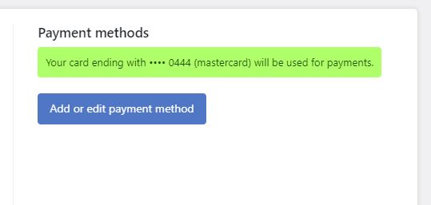

# Billing details

### Updating your billing details

To change your current billing details login to your WordPress site. Navigate to **Super Forms > Licenses** and login with your [Super Forms account](../../quick-start/registration.md#registering-a-new-account). After you are logged in click on **\[Billing]**. Here you will be able to update your existing billing details.

<figure><figcaption>
Updating your billing details.
</figcaption></figure>

### Updating your card details

To update an existing card or add a new one, you can login to your WordPress site. Navigate to **Super Forms > Licenses** from the WordPress main menu. Then login with your [Super Forms account](../../quick-start/registration.md#registering-a-new-account). After you are logged in click on **\[Billing]**. Under "Payment methods" you can click the blue button "Add or edit payment method".

<figure><figcaption>
Adding a new or updating an existing payment method (card).
</figcaption></figure>

