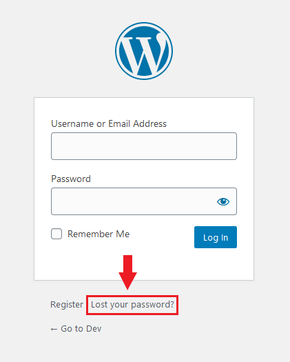
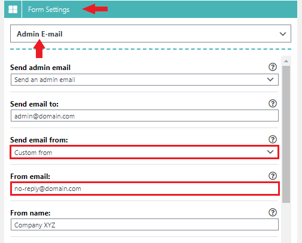

# Why is my form not sending emails?


**Tip:** Install a Mail logging plugin to see if WordPress is processing emails.


First check your **SPAM** folder, it might have been flagged as spam. If your email was inside your **SPAM** folder then read this guide on how to possibly resolve this:


[why-are-emails-going-into-spam-folder-inbox.md](why-are-emails-going-into-spam-folder-inbox.md)


Check if WordPress is sending E-mails when using the forgot password form. You can test this on the login page e.g. `yourdomain.com/wp-login.php` by clicking on the **Lost your password?** link.

<figure><figcaption>
Check if the default WordPress "Lost your password?" email work.
</figcaption></figure>

If you do not receive any E-mails it could be that your hosting disabled PHP `mail()`. If this is the case you mostly see an error message that notifies you about this.

If you did receive the lost password email then double check that your `Send email from:` setting is properly configured to match your domain name (see image below). Some mail servers do not allow to use a From header different from the domain name it is being send from.

<figure><figcaption>
Changing the email From header to match your current domain name.
</figcaption></figure>

If you are still unable to receive E-mails after the above steps, check if any other plugin is being used that overrides WordPress `wp_mail()` functionality.

If you are using a **SMTP plugin** or configured Super Forms to send emails via SMTP (from your WordPress menu: Super Forms > Settings > SMTP Settings), recheck if they are configured correctly.

To help track down the issue further you can also install a E-mail Log plugin. That way you can see if your WordPress site actually is sending the E-mails (programmatically speaking). You can also determine if the From E-mail is properly setup that way. If you don't see any E-mails being logged, it means the issue is on your WordPress installation. In these cases you will have to try to track down what plugin is causing it by disabling them. And re-enabling them one by one.

If the E-mails are being logged, and the From header is setup properly, but you are still unable to receive any email you will need to dig deeper (outside of your WordPress site).

Here are some extra checks to consider:\
&#x20;\
**1. SPF/DKIM/DMARC Alignment:**\
Verify that the SPF, DKIM, and DMARC records for '@yourdomain.com' are correctly aligned with the email sending infrastructure. Inconsistent or misconfigured authentication records can lead to delivery issues.\
&#x20;\
**2. Recipient Mailbox Full:**\
Confirm with the recipient whether their mailbox is full. If the mailbox is full, new emails may not be delivered.\
&#x20;\
**3. Recipient Inbox Rules:**\
Check if the recipient has any specific inbox rules or filters that could be affecting emails from '@yourdomain.com'. Some email clients allow users to set up rules for sorting or filtering incoming emails.\
&#x20;\
**4. Email Content or Format:**\
Examine the content and format of the emails sent by WordPress. Some email servers may be more strict in filtering emails based on content or formatting issues.\
&#x20;\
**5. Domain-specific Filtering:**\
Check if there are any specific filtering rules or settings configured for the domain '@yourdomain.com'. It's possible that certain security measures or filters are affecting emails from this domain.\
&#x20;\
**6. Recipient Server Configuration:**\
Review the configuration of the email server that handles '@yourdomain.com' emails. There might be specific settings or configurations causing the emails to be treated differently.\
&#x20;\
**7. Domain Reputation:**\
Verify the overall reputation of the domain '@yourdomain.com'. If the domain has a poor reputation, it might result in emails being treated differently by recipient servers.\
&#x20;\
**8. Check with WordPress Hosting Provider:**\
Contact the hosting provider for the WordPress site and inquire if there are any known issues or restrictions related to sending emails to '@yourdomain.com'.\
&#x20;\
**9. Server or Network Issues:**\
Investigate if there are any server or network issues specifically affecting the communication between the WordPress server and the email server responsible for '@yourdomain.com' addresses.\
&#x20;\
**10. SMTP Configuration:**\
If WordPress is using SMTP for sending emails, review the SMTP configuration settings. \
Ensure that the SMTP server and credentials are configured correctly for '@yourdomain.com'.\
If you are currently not using SMTP consider configuring your WordPress site to deliver E-mails via your SMTP server. This helps with deliverability.
