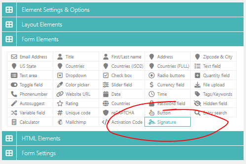

# Signature

### Adding the Signature to your form

From the Form Elements panel on the builder page, simply drag and drop the Signature element to your form canvas. As shown below:

<figure><figcaption>
WordPress Signature Form
</figcaption></figure>

### Customizing the signature appearance

After adding the signature to your form canvas, you can configure the size of the signature area if needed. Optionally you can also exclude it from the Admin or Confirmation E-mails if needed.

<figure><figcaption>
Editing the signature for your form
</figcaption></figure>

<figure><figcaption>
Setting the signature width and height for your form
</figcaption></figure>

After changing the width and height to 500x200 the signature drawing area (box) would look something like this:

<figure><figcaption>
Custom signature drawing area dimensions
</figcaption></figure>

Apart from these settings you can also set the line/stroke thickness of the signature, the color.&#x20;

When you are using any of the Super Forms population methods to retrieve existing data from a previous form submission, you can enable the option to disallow the user to change the existing signature.

By default the signature will have a background image that indicates a signature can be drawn by the user. You can optionally change this image if nesscasary.

<figure><figcaption>
Changing the signature line thickness and color on your form
</figcaption></figure>

### Displaying your signature in E-mails

By default the signature will be attached to your E-mails after the form is submitted. If you don't want this, you can configure it to be excluded from the E-mail.

### Storing the signature in the generated PDF

If you are composing a PDF file with the [PDF Generator Add-on](../../features/integrations/pdf-generator.md), your signatures will be included in the PDF file by default unless you configured it to be excluded from the PDF file. Alternatively you can use the [Tags system](../../features/advanced/tags-system.md) to retrieve the signature as specific locations by using the [HTML element](../html-elements/html-raw.md).

In case you want to set up automation to send signed documents to relevant parties, update records, or trigger follow-up actions, checkout the [Zapier ](../../features/integrations/zapier.md)integration for Super Forms to connect with almost any third party software.
