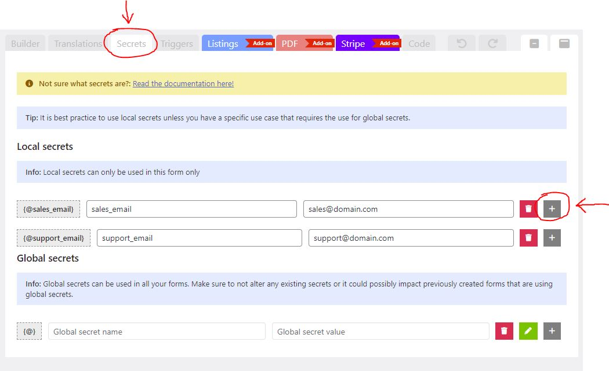
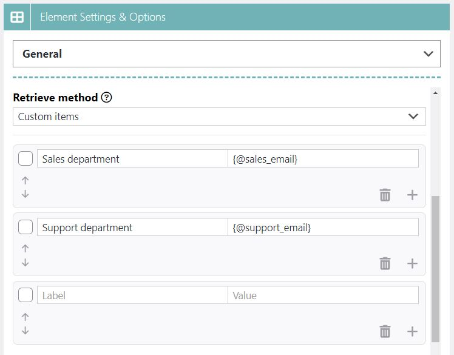
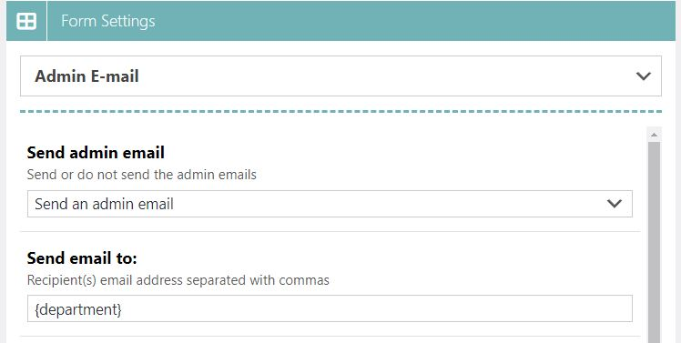

# Secrets

### What are secrets? 

Secrets are values (or data) which you can store locally or globally. The value will only be rendered on the server side and won't be visible inside the HTML source code on the client side.

You can retrieve these secrets inside your form settings with the use of tags prefixed with a `@` sign e.g. `{@secret_email}` or `{@my_secret_name}`.

It's also possible to use these secrets inside your fields. The difference with normal {tags} ([Tags system](tags-system.md)) being that they will not be replaced with their underlaying value upon page load. This prevents it's value from being exposed to the client via the source code.

### When to use secrets? 

A good use case on when to use secrets is when you wish to conditionally ([Conditional Logic](conditional-logic.md)) send an email to a specific email address based on what the user selected/choose in the form.

For instance: your company might have different departments `support@domain.com`, `sales@domain.com`.

Normally you could do this by inserting these email addresses directly inside a [Dropdown element](../../elements/form-elements/dropdown.md), or perhaps via the use of a hidden field or [Variable field](../../elements/form-elements/variable-field.md).

This would however expose the email address inside the HTML source code (client side). This would allow bots to crawl/scrape the email address from the source code and ending up sending SPAM to the email address.

By using `Secrets` you can prevent this. The value of a secret is not retrieved upon page load, and will never be visible to the client.

A secret tag e.g. `{@sales_email}` will only be replaced with it's underlaying value upon form submission on the server side. This way Super Forms can still retrieve this value inside the form settings so that you can have a dynamic value for your settings.

### Difference between local and global secrets 

There are two types of secrets: `local` and `global`.

The difference between the two are that local secrets can only be used on the form you are working on while global secrets are site wide and are available inside all other forms.


**Note:** Keep in mind that it's best practice to use **local** secrets unless you have a good usecase that requires the use of global secrets. This is because if you change one of your global secrets it can possibly cause issues on forms that also use this global secret.


### How to use secrets? 

There are a couple of ways to implement secrets into your forms. The most common situation would be when you need to conditionally retrieve sensitive value based on some user selection.

A good example would be sending the form submission to a specific department conditionally.

First you will want to define your secrets. You can do so by editing your form and navigating to the TAB `Secrets` at the top left of the builder page. In this example we will define the following secrets:

* `sales_email` - `sales@domain.com`
* `support_email` - `support@domain.com`

You can add multiple secrets by clicking the `+` icon as shown below:

<figure><figcaption>
Define secrets to securely retrieve values server side
</figcaption></figure>

Once you defined your secrets you can copy the tags `{@sales_email}` and `{@support_email}`.

Now create a [Dropdown element](../../elements/form-elements/dropdown.md) and define the items of your dropdown. We will set a **Label** and **Value** for each dropdown item where the **Value** will contain the secret tag like so:

Label: `Sales department`, Value: `{@sales_email}`\
Label: `Support department`, Value: `{@support_email}`

<figure><figcaption>
Define secret tags for your dropdown items.
</figcaption></figure>

Rename the dropdown to `department` and update the element. Now open up your `Form Settings` and choose `Admin E-mail` from the dropdown. Now enable the sending of Admin emails for the form and update the `Send email to:` setting so that it retrieves the secret tag from the dropdown field. Since the dropdown field is named **department** we can use the tag:`{department}`.


You are also allowed to use the secret tags `{@secret_tag}`directly in your form settings if you don't require to retrieve it dynamically based on user input.


<figure><figcaption>
Retrieve the department dropdown (secret) value in your Email settings
</figcaption></figure>


**Note:** When configuring your Email settings, make sure to double check that your **Send email from:** is correctly set to send emails from your actual domain name e.g. no-reply@**mydomain.com**.

