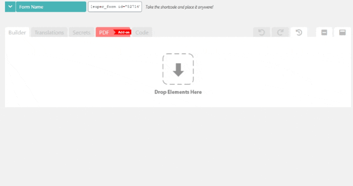
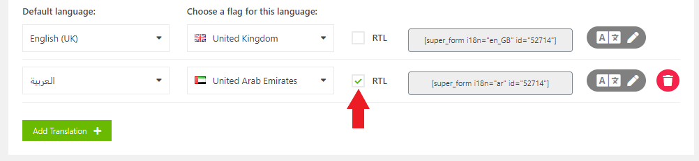
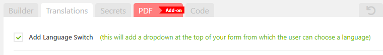
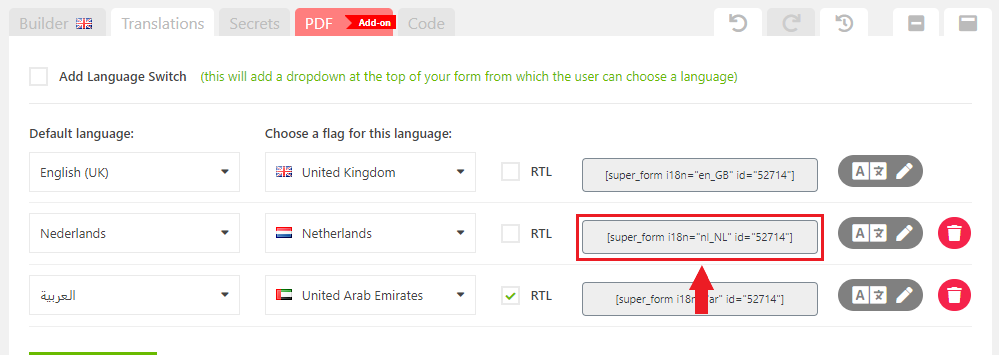

# Build In Translation System

## Defining translation for your form

Simply visit the `Translations` TAB when editing your form and define the languages required for your specific form as shown below.

<figure><figcaption>
Define languages for your form under the Translations TAB on the builder page.
</figcaption></figure>

## Enabling RTL (right to left) layout for your language

In case your language requires **RTL** (right to left layout) you can enable it per language individually:

<figure><figcaption>
Enabling RTL (left to right) layout for your languages.
</figcaption></figure>

## Allowing users to switch to a different language manually

Enable the **Language Switch** if you want to display a dropdown above the form so that the user can change to a different language manually:

<figure><figcaption>
Option to display a dropdown on the front-end so that users can switch to a different language manually.
</figcaption></figure>

<figure><figcaption>
User manually switching language via the dropdown.
</figcaption></figure>

## Loading a specific language via a shortcode

You can also display a fixed language for your form by grabbing the **shortcode** e.g. `[super_form i18n="nl_NL" id="1234"]` by defining the language attribute e.g `en_GB`.

That way you can disable the **Language Switch**, and use a build in language plugin like WPML to display the correct form based on the language of the page.

<figure><figcaption>
Language specific shortcode to display the form on your multilingual WordPress site
</figcaption></figure>

## Demonstration of Translation form on the front-end

A front-end demo can be found here:


Front-end demo of the build-in Translation system.


