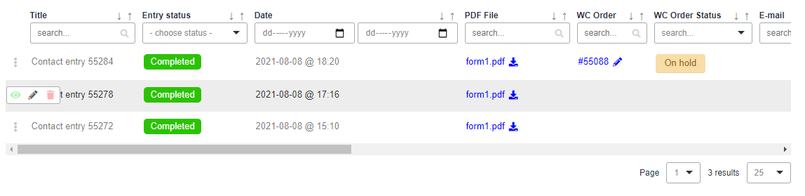
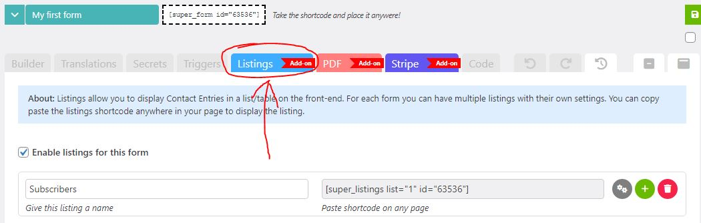
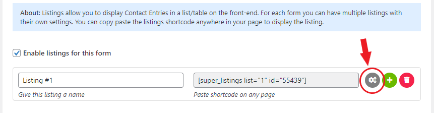

# Listings


**Tip:** Read the [Quick start](listings.md#quick-start) guide to get your first listing up and running quickly.


### About

This Add-on allows you to display contact entries on your front-end in a table like fashion (list). Hence the name "Listings". A quick preview of how a listing might look on your Front-end:

<figure><figcaption>
A table/list on the WordPress front-end displaying contact entries (form submissions).
</figcaption></figure>


You can try this Add-on for 15 days for free by going to **Super Forms > Add-ons** in your WordPress dashboard.


### Quick start

The Add-on comes with a 15 day free trial, so you can try it out for free. To enable the trial, login to your WordPress site and navigate to **Super Forms > Licenses**. On this page you can start the 15 day trial for the **Listings** Add-on. Once the trial is activated, you can navigate to any of your existing forms via **Super Forms > Your forms**, or create a new form **Super Forms > Create form**.

Now click on the **\[Listings]** TAB at the top of the builder page:

<figure><figcaption>
Creating and configuring a listing for your WordPress form.
</figcaption></figure>

Here you will find all the settings and options for the Add-on. To create your first listing, you can check the option **Enable listings for this form**. To edit your listings settings you can click the cogwheell icon as shown below:

<figure><figcaption>
Edit an existing listing from the back-end.
</figcaption></figure>


**Tip:** you most likely will want to setup a page with a Fullwidth layout (if your theme supports it), this way the most columns can be visible at once (in case you have many columns defined to be displayed)


Depending on your settings your listing should be visible (or not) and might look something like this:

<figure><figcaption>
Example of how the list/table might look on your WordPress site.
</figcaption></figure>

### Settings

There are many settings that give you control over what and how the listing will be displayed to the end-user, such as:

* Control to who the listing will be displayed and display an optional message to other users that can't view it;
* Control from which forms entries should be retrieved, e.g. "Current form", "All forms", or "Specific form ID's";
* Only retrieve entries between a specific date range (from/till), you can leave from or till blank to have no limit on either side;
* Control who can see which entries
* Optionally display a message to the user if no entries are found
* Allow/Disallow administrators or other roles/ID's to **view** any entries
* Allow/Disallow users to **view** their own entries
* Allow/Disallow administrators or other roles/ID's to **edit** any entries
* Allow/Disallow users to **edit** their own entries
* Allow/Disallow administrators or other roles/ID's to **delete** any entries
* Allow/Disallow users to **delete** their own entries
* Show custom columns that will be mapped to your form fields and whether or not they can filter/sort this column
* Show predefined columns and whether or not they can filter/sort this column
  * Entry title;
  * Entry status;
  * Entry date;
  * WC order _(Add-on required)_;
  * WC order status _(Add-on required)_;
  * PayPal order _(Add-on required)_;
  * PayPal order status _(Add-on required)_;
  * PayPal subscription _(Add-on required)_;
  * Created post title _(Add-on required)_;
  * Created post status _(Add-on required)_;
  * Generated PDF _(Add-on required)_;
  * Author username _(if user was logged in during form submission)_;
  * Author first name _(if user was logged in during form submission)_;
  * Author last name _(if user was logged in during form submission)_;
  * Author full name _(if user was logged in during form submission)_;
  * Author nickname _(if user was logged in during form submission)_;
  * Author display name _(if user was logged in during form submission)_;
  * Author E-mail _(if user was logged in during form submission)_;
  * Author ID _(if user was logged in during form submission)_;
* For each column you can define if the value should have a link to one of the following options
  * None (no link);
  * Edit the contact entry (backend);
  * WooCommerce order (backend);
  * WooCommerce order (front-end);
  * PayPal order (backend);
  * PayPal subscription (backend);
  * Generated PDF file;
  * Created post/page (backend);
  * Created post/page (front-end);
  * The author page (front-end);
  * The author profile (backend);
  * Author E-mail address (mailto:);
  * E-mail address (mailto:);
  * Custom URL;

### Pricing

<table><thead><tr><th width="152">Volume</th><th width="189">Price per license</th><th>Total</th></tr></thead><tbody><tr><td>1+</td><td>$5</td><td>1 license would cost $5 p/m</td></tr><tr><td>5+</td><td>$3</td><td>5 licenses would cost $15 p/m</td></tr><tr><td>10+</td><td>$2.5</td><td>10 licenses would cost $25 p/m</td></tr><tr><td>20+</td><td>$2</td><td>20 licenses would cost $40 p/m</td></tr><tr><td>40+</td><td>$1.5</td><td>40 licenses would cost $60 p/m</td></tr></tbody></table>
