# PayPal

## Quick start

### Step 1 – Enabling PayPal Checkout

Go to **Super Forms > Create Form** (or edit an existing form of your choosing). Open the **Form Settings** section on the right hand side. From the dropdown menu choose **PayPal Checkout** (this will open all the settings related to the PayPal checkout process). Make sure to Enable the PayPal Checkout by clicking "Enable PayPal Checkout".

<figure>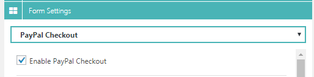<figcaption>
Enable PayPal checkout for your WordPress form.
</figcaption></figure>


**Tip:** it is recommended to always enable the PayPal Sandbox mode during testing of your form. That way you can test as many times as you wish without making real transactions with real money. You can create a [sandbox account](https://www.sandbox.paypal.com/nl/webapps/mpp/business) here.


To enable the sandbox mode on your form you can check the **Enable PayPal Sandbox mode (for testing purposes only)**.

<figure>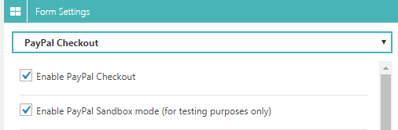<figcaption>
PayPal enable sandbox mode for your WordPress form
</figcaption></figure>

### Step 2 – Adding merchant email to receive payments

You can now go ahead and enter the PayPal merchant email. This will in most cases be your own PayPal email address account where you wish to receive payments on. In some cases you might have a form that requires to dynamically retrieve the email address based on user selected information. In that case you can use {tags} to retrieve this data. For now just enter your sandbox email address (see picture below):

<figure>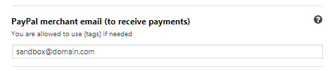<figcaption>
PayPal enter the merchant email
</figcaption></figure>

### Step 3 – Choosing your currency

The next important thing to change accordingly is the currency for the PayPal checkouts. Depending on your country you can change this to for instance `USD` ($), `EUR` (€) or any other currency supported by PayPal.

<figure>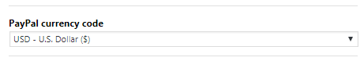<figcaption>
PayPal checkout currency setting.
</figcaption></figure>

### Step 4 – Shipping address requirement setting

Normally when a user checkouts out via PayPal you would ask for an address. But because you might already have the address of the user (filled out in the form) you could let the user skip to enter their shipping address. There are 3 options you can choose from. The most common one to choose would normally be the default value, but you can change it to any of the following if required:

<figure>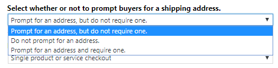<figcaption>
PayPal shipping requirement settings.
</figcaption></figure>

### Step 5 – Choosing the payment checkout type

In order to be able to checkout with PayPal, PayPal must know what type of checkout you want to do. It allows you to handle 4 different checkout types/methods. Depending on your needs you can choose one of the following methods:

<figure>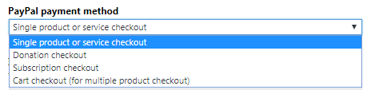<figcaption>
PayPal checkout payment type.
</figcaption></figure>

Each payment method is explained here:

* [Single product or service checkout](paypal.md#single-product-or-service-checkout)
* [Donation checkout](paypal.md#donation-checkout)
* [Subscription checkout](paypal.md#subscription-checkout)
* [Cart checkout (for multiple product checkout)](paypal.md#cart-checkout-for-multiple-product-checkout)

If you do not want information about each payment method you can click here to [Step 6 – Setting up return URL](paypal.md#step-6-setting-up-return-url)

#### **Single product or service checkout**

This method is meant for only 1 product checkouts. When using this payment method you will only have to set the `Item description` (this will be your product name). The `Item description` option is compatible with {tags} so you can dynamically set this based on user selected options in your form. Of course your product has a price, which you can set under `Item price` (must be float number e.g. 12.59). The `Item price` option is also compatible with {tags} so you can also dynamically set the price based on user selected options in your form. The last requirement is the `Quantity` to be added to the PayPal checkout basket (must be a numeric value).

Below you can see all the settings with example values that you could enter:

<figure>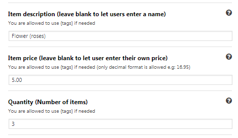<figcaption>
PayPal single product or service checkout.
</figcaption></figure>

#### **Donation checkout**

The Donation checkout method is only used for... (you guessed it) donations. A donation checkout requires the same options as the `Single product or service checkout` method with the exception that there is no `Quantity` option available for this method.

#### **Subscription checkout**

The Subscription checkout can be used when you wish to create a new subscription for the user who filled out the form. When enabled you will be prompted to choose the `Item description` just like you would with the `Single product` and `Donation` methods. The Subscription checkout has an extra option to set `Subscription periods`. Here you will be able to adjust the time frame regarding the subscription. A subscription may also have a trial period and a second trial period. The Subscription periods option is compatible with {tags} so you can dynamically create subscription time periods based on user selected options in your form. A good way to achieve this would be to use a variable field.

Please refer to the below examples to fully understand how to set it up for your own use cases:

**Example without trial period:**

You want to create a subscription without a trial period that costs $20.50 p/m:

<figure>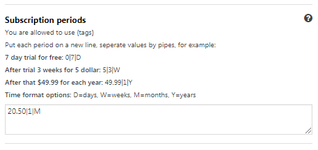<figcaption>
PayPal subscription without trial period.
</figcaption></figure>

**Example with 1 trial period:**

You want to create a subscription with 1 trial period for 3 days and after trial period is over $2 per week:

<figure>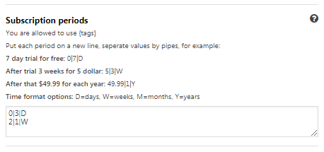<figcaption>
PayPal subscription with one trial period.
</figcaption></figure>

**Example with 2 trial periods:**

You want to create a subscription with 2 trial periods (1st 1 week trial), 2nd (2 weeks for $3 p/w), after that $18 p/m:

<figure>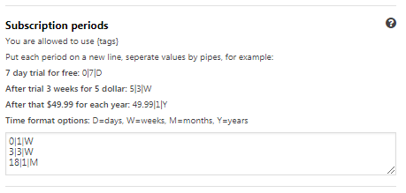<figcaption>
PayPal subscription with multiple trial periods.
</figcaption></figure>

#### **Cart checkout (for multiple product checkout)**

The Cart checkout will only be used and required whenever you want to send users to the PayPal checkout where they will checkout multiple products at once. In other words, it will function as a shopping bag/cart just like with a regular web shop. To add multiple items to the PayPal checkout you have to enter each item under the `Items to be added to cart` option. Each item can contain the following variables:

`{price}|{quantity}|{item_name}|{tax}|{shipping}|{shipping2}|{discount_amount}|{discount_rate}`

In most use cases you will only be using the first 3 options like so:

`{price}|{quantity}|{item_name}`

Where `price`, `quantity` and `item_name` should be replaced with your field names, please read the Tags system for more information about tags. To fully understand how PayPal handles these variables please read the [PayPal's Variable Reference](https://developer.paypal.com/api/nvp-soap/paypal-payments-standard/integration-guide/Appx-websitestandard-htmlvariables/). Please refer to the below examples to fully understand how to set it up for your own use cases:

**Example with fixed values:**

You want to add 2 products to the PayPal cart (5x Flowers $3.49) and (3x Towels $7.25):

<figure>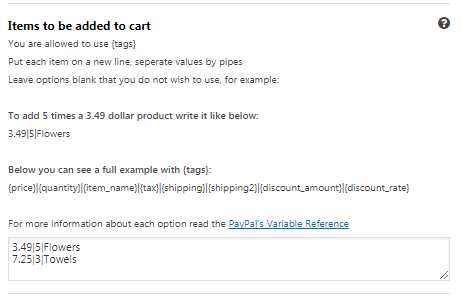<figcaption>
PayPal checkout products with fixed price and quantity.
</figcaption></figure>

**Example with dynamic price, retrieved from your form with tags:**

Based on user selected option you want to dynamically return the price for a fixed product and the user selected quantity:

<figure>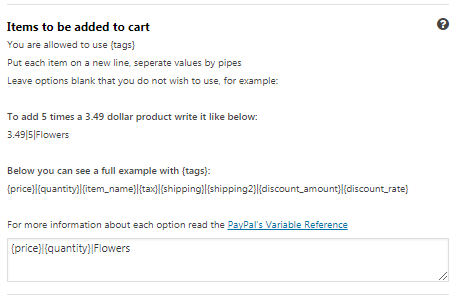<figcaption>
PayPal cart checkout with dynamic price and quantity.
</figcaption></figure>

**Example with products inside a dynamic column:**

Let's say you have a dynamic column setup with super forms with inside quantity element, dropdown for product name, and a variable field that is updated based on the dropdown option. You will have multiple products depending on how many times the user would add a new set of fields by clicking the + button on the dynamic column. You will be able to simply enter the following {tags} and it will automatically add all the available options to the PayPal checkout.

<figure>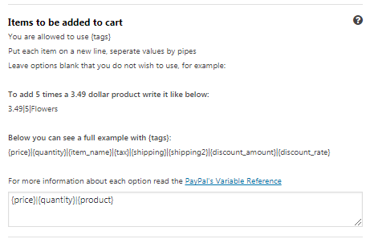<figcaption>
PayPal cart checkout with multiple products.
</figcaption></figure>

### Step 6 – Setting up return URL

After you finished all the above steps and chosen your desired payment method for your checkout, you can now setup a proper return URL. This is the URL where a user will be redirect to after the user successfully returns from PayPal. This can be any URL of your choosing. By default it will be `http://yourdomain.com/?page=super_paypal_response` PayPal will post information about the transaction in the form of Instant Payment Notification messages. This can optionally be used by the developer to display any data regarding the payment on the page.


**Note:** make sure you properly change this to your own needs before going live.


### Step 7 – Setting up cancel URL

This URL will be used to redirect the user back to your website after they canceled the checkout process on PayPal checkout page. User that cancels payment will be redirected to this URL. This can be any URL of your choosing, but by default it will be: `http://yourdomain.com/my-custom-canceled-page`

<figure>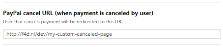<figcaption>
Configure PayPal cancel URL.
</figcaption></figure>


**Note:** make sure you properly change this to your own needs before going live.


### Step 8 – Sending E-mail after payment completed

Of course you'd like to notify your customer after the payment was completed. Perhaps you want to send them an attachment, or a signup URL, or just the overview of their order. You can do so by enabling the option `Send email after payment completed` and configuring the email settings.

### Step 9 – Testing with sandbox account before going live

The last step is to test your form functioning before going live. Use your PayPal sandbox account to simulate payments and various form submissions. If you have created an advanced form with Super Forms, try to test as many of the possible variations your form offers before going live. If everything was setup correctly you should see transactions and/or subscriptions coming in under `Super Forms > PayPal transactions/subscriptions`. If you are not seeing any transactions coming in, you have to look in your sandbox account for response codes from the IPN.

#### **PayPal Transactions:**

<figure>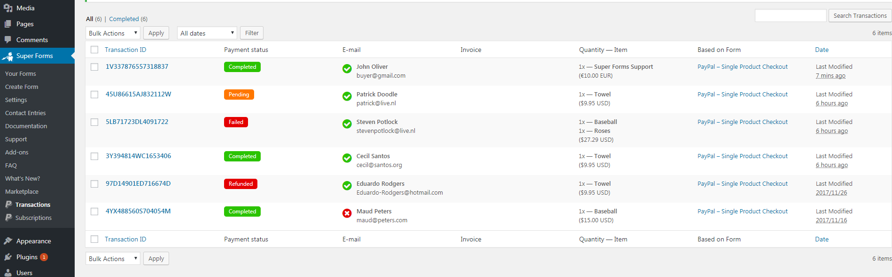<figcaption>
PayPal transactions list WordPress back-end
</figcaption></figure>

#### **PayPal Subscriptions:**

<figure>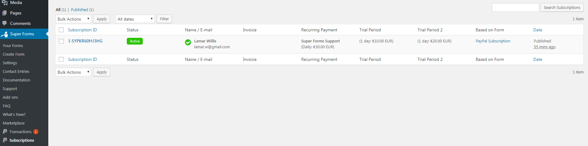<figcaption>
PayPal subscriptions list WordPress back-end
</figcaption></figure>

