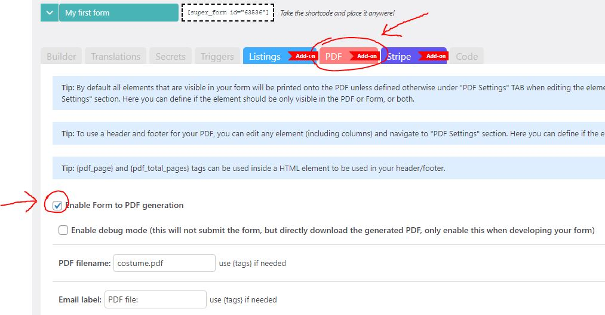

# PDF Generator

### About

This Add-on allows you to convert any form submission into a PDF file which would look identical to how the form was displayed on the front-end in the browser.

When a user submits the form, the PDF will be generated and optionally (if enabled) attached to the Admin and/or Confirmation E-mail.

### How PDF Generation Works


**Important:** PDF generation is entirely **frontend-gated**. This means the entire form submission pipeline — including saving the entry and sending all e-mails — is blocked until the PDF is fully generated in the user's browser. The server-side AJAX call that saves data and dispatches e-mails is only made **after** client-side PDF generation completes successfully.

If PDF generation stalls or fails in the browser, the form submission will appear frozen indefinitely and no e-mails will be sent, even though the Submit button was clicked.


When a form with PDF generation enabled is submitted, the following sequence occurs:

1. The user clicks Submit. A loading overlay is displayed (e.g. "Generating PDF file...").
2. After a short delay, the browser begins rendering the form into a PDF using the client-side PDF library.
3. Once generation is complete, the generated file is injected into the submission payload.
4. The AJAX call to the server is made — the entry is saved, e-mails are dispatched, and attachments are assembled.

If step 2 or 3 never completes (e.g. due to a rendering stall), the user remains on the loading screen permanently, and the server never receives the submission.


**No server-side PHP error log will be generated** if the frontend PDF generation stalls, because the AJAX endpoint is never called. All diagnostic information will be in the **browser console**.


#### Forms most likely to cause generation stalls

The following form characteristics increase the risk of a PDF generation freeze:

* **High element count** — forms with many fields or sections take longer to render.
* **Multi-page forms** — each page must be captured separately, multiplying render time.
* **Heavy conditional logic** — complex show/hide rules may affect layout calculation during render.
* **Large file upload fields** — image previews or attachments embedded in the PDF increase memory usage.
* **Custom fonts or high render scale** — increases CPU and memory requirements during generation.

The PDF file will also be attached to the Contact Entry (if enabled).

You also have the option to specifically include or exclude elements from the PDF, which should give you a ton of flexibility to choose from.

You can also define a Header and Footer element which would then be visible on all pages of the generated PDF file.

### Debug Mode

The PDF Generator has a built-in **debug mode** that is the recommended first step when diagnosing PDF-related issues.

When debug mode is enabled:

* The form will **not be submitted** when the Submit button is clicked.
* Instead, the generated PDF will be **immediately downloaded** to the user's browser.
* This allows you to verify the PDF output without affecting saved entries or sent e-mails.

**To enable debug mode:**

1. Open the form in the builder and click the **\[PDF]** tab.
2. Under **General settings**, check the **Enable debug mode** option.
3. Save the form and test it on the front-end.


**Only enable debug mode during development.** Disable it before making the form live, as it prevents form submission entirely.


Debug mode also exposes the raw PDF settings object in the browser's JavaScript console, which can help identify configuration mismatches between forms.

### Quick start

Login to your WordPress site and navigate to: **Super Forms > Licenses**. Start the 15 day trial for the PDF Generator Add-on. Once the trial is activated, you can navigate to any of your existing forms via **Super Forms > Your forms**, or create a new form via **Super Forms > Create form**.

Now click on the **\[PDF]** TAB at the top of the builder page. Here you will find all the settings and options for the Add-on. To enable PDF generation you can simple check the option Enable Form to PDF generation.

<div align="left"><figure><figcaption><p>Enable form to PDF generation for your WordPress form.</p></figcaption></figure></div>

When the form is submitted a PDF file will be generated with all the form data.

### Include and exclude elements from the PDF

When [creating your form](../../quick-start/creating-a-form.md), you will [add some elements](../../quick-start/adding-form-elements.md) which by default are visible to the user unless defined otherwise. Any element that is visible to the user will also be visible in the generated PDF. However you can override this behavior be [editing any element](../../quick-start/editing-elements.md#editing-a-single-element) in your form and navigating to the **PDF Settings** section where you can choose between one of the following options:

* Show on Form and in PDF file (default)
* Only show on Form
* Only show in PDF file
* Use as PDF header
* Use as PDF footer

### Setting up a Header and Footer for your PDF file

In order to enable a header or footer for your PDF file, you must define which element in your form should act as such.


**Note:** your form can only have one element defined to act as the header, and only one to act as the footer.


When you require more elements to be placed in either one, you can simply use a [Column ](../../elements/layout-elements/column-grid.md)element and define it as your header or footer. Just put the elements that you require inside this column.

You can enable a header by [editing your element](../../quick-start/editing-elements.md#editing-a-single-element) and navigating to the **PDF Settings** section. There you can choose between **Use as PDF header** or **Use as PDF footer**.

#### Displaying pagination

Inside your header and footer you can use the tags **{pdf\_page}** and **{pdf\_total\_pages}** inside a HTML element to display the current page. For example, the below HTML:

```
Page {pdf_page} of {pdf_total_pages}
```

Would translate to:

```
Page 2 of 13
```

### Using a dynamic PDF filename

When the PDF file is saved or downloaded it will have a default name **form.pdf**.

You can change this under the PDF filename setting. This setting is compatible with the [Tags system](../advanced/tags-system.md) so that you can generate dynamic filenames based on user input data.

For instance, when you have a form with the fields named `first_name` and `last_name`, you can define your filename as follows:

```
{first_name}-{last_name}.pdf
```

Which could translate to:

```
John-Doe.pdf
```

### Attaching the generated PDF file to your E-mails

By default the PDF will be attached to the Admin and Confirmation E-mail, but you can disable this by unchecking the option **Attach generated PDF to admin e-mail** or **Attach generated PDF to confirmation e-mail**.

### Exclude the PDF from contact entry data

By default the PDF will be saved in the Contact Entry (if you enabled to save Contact Entries that is). You can disable this by checking **Do not save PDF in Contact Entry**.

### Show download PDF button

In some cases you might not send any E-mails and perhaps not even save a Contact Entry, but you might just want to download the PDF file that was generated. In that case you can display a \[Download PDF] button to the user after the form was submitted.

You can enable this by checking the Show download button to the user after PDF was generated setting. Optionally you can define the download button text e.g. "Download Summary" or "Download PDF file" (or anything that suits your use case). You can also define the text that should be displayed during the PDF generation itself e.g. "Generating PDF file..."

### Page orientation portrait and or landscape

By default the generated PDF file has it's orientation set to "Portrait", but for some use cases you might prefer the "Landscape" orientation.

You can change the orientation via the **Page orientation** setting.


**Tip:** you can also change the orientation of the next page with the [**PDF page break**](../../elements/html-elements/pdf-page-break.md) element which can be found under the [HTML Elements](../../elements/html-elements/) section.


### Unit of measure, page format and margins settings

There are several more settings which you can define, which are listed below:

* **Unit** `mm (default)`, `pt`, `cm`, `in`, `px`
* **Page format** `a3`, `a4 (default)`, `a5`, `letter`, `legal`, `Custom page format` etc.
* **Body margins** top/right/bottom/left
* **Header margins** top/right/bottom/left
* **Footer margins** top/right/bottom/left

### PDF Render scale (resolution/sharpness/quality)

This option allows you to fine tune the resolution of the generated PDF file. This setting should be left to the default value for best results, unless you require a higher resolution.


**Note:** you will lose "pixel" quality when lowering the render scale.


If your PDF file size is becoming to large you might want to consider lowering the render scale setting at a rate of **0.1** at a time during testing. When working with large forms it is important to check the PDF file size during development and to adjust the render scale accordingly if needed.

### Native PDF elements


This feature is currently only available in the [BETA version](../../developers/beta-version.md).


When you enable the PDF to generate native elements, it will not take a snapshot (image) of the form. Instead it will use native PDF elements which makes the render process quicker, and the PDF file size smaller.

In most cases you will want to enable this mode. This is now the preferred method. The downside is that it might not look 100% identical to how the form looks on the front-end. So you might want to try both methods, and see which one suits your use case best.

### Smart page breaks


This feature is currently only available in the [BETA version](../../developers/beta-version.md).


With smart page breaks enabled any element and or text will automatically be pushed onto the next page in case it didn't fit on the previous page for the full 100%.

### Troubleshooting: Form Freezes at "Generating PDF File"

If a form stalls indefinitely after submission with the loading overlay showing "Generating PDF file..." and no e-mail is received, follow these steps.

#### Step 1: Check the browser console

Open your browser's developer tools (F12) and go to the **Console** tab before clicking Submit. Look for:

* JavaScript errors (red text) at the moment the freeze occurs.
* Warnings or stack traces involving PDF-related functions.
* Network errors if the page was making AJAX calls at the time.


Because generation happens entirely in the browser, **no PHP error log will be written** during a stall. The browser console is your only diagnostic window for this scenario.


#### Step 2: Enable debug mode

Enable **debug mode** (see [Debug Mode](pdf-generator.md#debug-mode) above) on the affected form. This forces an immediate PDF download instead of submission, letting you:

* Confirm that the PDF generator itself can complete on this form.
* Inspect the generated output for rendering issues.

If the debug-mode download also stalls or fails, the issue is in the PDF rendering stage. If the download succeeds but submission still fails, check your server settings (Step 4).

#### Step 3: Compare settings with a working form

If an identical form on the same site works correctly:

1. Open both forms in the builder side by side (in separate tabs).
2. Navigate to the **\[PDF]** tab on each form.
3. Compare every setting field by field: render scale, native mode, page format, margins, smart page breaks, etc.
4. Also compare the **PDF Settings** section of each individual form element — check for elements set to "Only show in PDF file" or "Use as PDF header/footer".

Even a single different setting (e.g. a much higher render scale, or an element embedded only in the PDF) can cause a freeze on one form but not another.

#### Step 4: Check server PHP limits

Although PDF generation happens in the browser, the process may make AJAX requests to the server mid-generation (e.g. for font or resource loading). If your server has restrictive settings, those requests can time out or fail silently:

* **`memory_limit`** — Low PHP memory (e.g. 64M) can cause the server to reject mid-generation requests. Recommended: 256M or higher.
* **`max_execution_time`** — Short execution limits (e.g. 30s) may terminate server requests used during generation. Recommended: 120s or higher.

You can check or adjust these settings in your `php.ini`, `.htaccess`, or via your hosting control panel. After making changes, clear any caching plugins and retry.

#### Step 5: Simplify the form temporarily

To isolate the problematic element:

1. Make a copy of the affected form.
2. Remove half the elements and test submission.
3. If it works, restore those elements and remove the other half.
4. Repeat until the specific element causing the stall is identified.

Complex elements — especially those with conditional logic, embedded images, or custom HTML — are common culprits.

### Pricing

<table><thead><tr><th width="152">Volume</th><th width="189">Price per license</th><th>Total</th></tr></thead><tbody><tr><td>1+</td><td>$5</td><td>1 license would cost $5 p/m</td></tr><tr><td>5+</td><td>$3</td><td>5 licenses would cost $15 p/m</td></tr><tr><td>10+</td><td>$2.5</td><td>10 licenses would cost $25 p/m</td></tr><tr><td>20+</td><td>$2</td><td>20 licenses would cost $40 p/m</td></tr><tr><td>40+</td><td>$1.5</td><td>40 licenses would cost $60 p/m</td></tr></tbody></table>
