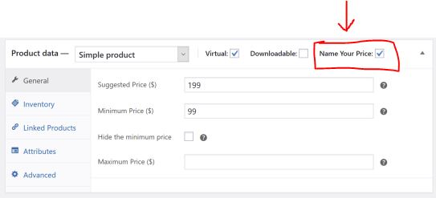
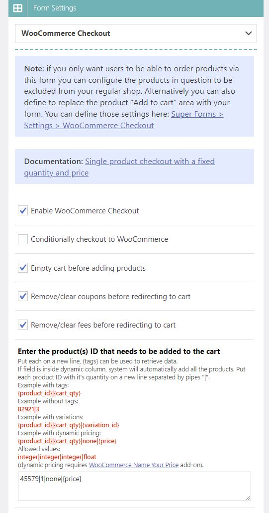

# Dynamic price checkout


In order for this to work you must have the official [**Name Your Price**](https://woocommerce.com/products/name-your-price/) plugin installed and activated. And you must enable the "Name Your Price" option for your product.


### Enable Name Your Price for the product

First make sure you have the official Name Your Price plugin installed and activated on your WordPress site. Now create a new product or edit an existing product. Make sure you enable the "Name Your Price" option for the product as shown below and Save the product to apply the changes.

<figure><figcaption>
Enable "Name Your Price" for your product.
</figcaption></figure>

### Enabling WooCommerce Checkout on your form

Now we need to enable the WooCommerce Checkout on our form. Go to "Super Forms > Your Forms" from the WordPress menu and edit your form. Open the "Form Settings" panel and choose "WooCommerce Checkout" from the dropdown. Check the "Enable WooCommerce Checkout" to enable it.

<figure><figcaption>
Enabling the WooCommerce checkout feature for your form.
</figcaption></figure>

### Define the dynamic priced product to be added to the cart

Before we can do so, we must obtain the product ID that we wish to add. You can find your product ID by going to "Products > All products" and hovering over the product with your mouse like so:

<figure><figcaption>
Finding the WooCommerce product ID
</figcaption></figure>

Another way of doing this would be to "Edit" the product and looking at the URL in your browser. You will be able to find the product ID in the URL as shown below:

https://domain.com/wp-admin/post.php?post=**45579**\&action=edit

Now that we have our product ID, we can configure our setting so that it adds the product with ID **45579** a quantity of **1**, no variation (defined as **none**)and a dynamic price by retrieving our price from our form with the use of the [**Tags System**](../../advanced/tags-system.md). In the below example we retrieve the price from a [**Calculator element**](../../../elements/form-elements/calculator.md) named "price". That's why we use the `{price}` tag in the below example.

<figure><figcaption>
Defining dynamic priced product to be added to WooCommerce cart after form submission.
</figcaption></figure>

After you Save the form and submit it (either from preview mode or from the front-end), it will add the product the the users cart with the amount that the [Calculator element](../../../elements/form-elements/calculator.md) holds. It will then redirect the user to the WooCommerce checkout or cart page (depending on how you configured the settings). The user can now complete the order as usual.
