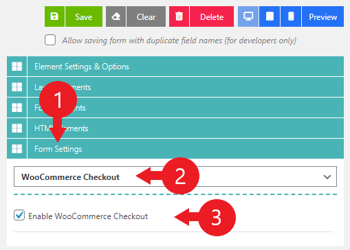
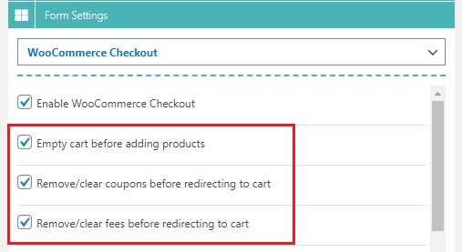
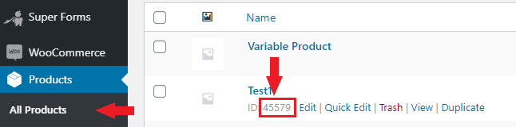
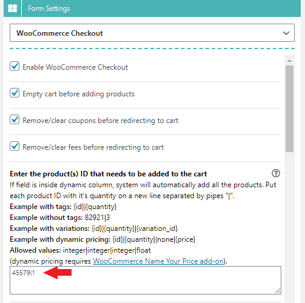
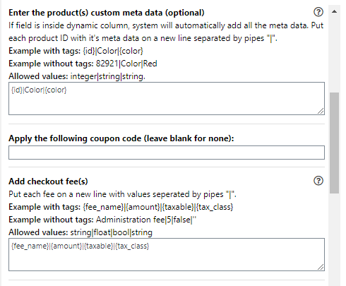
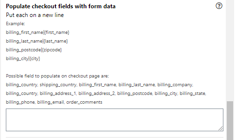
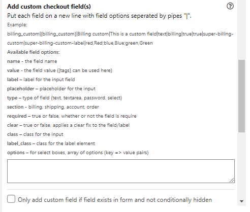
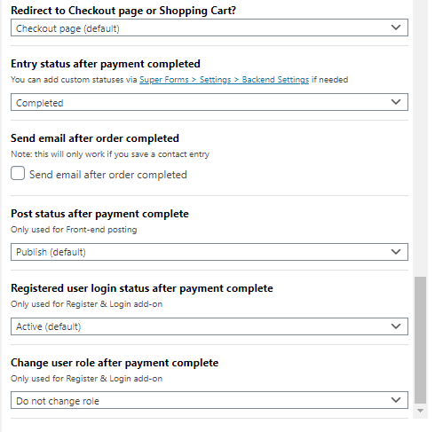

# Fixed price checkout


This article explains how to add a product with a fixed price to your cart. If you are looking for a way to add dynamic priced products to your cart you can read the [**Dynamic price checkout**](dynamic-price-checkout.md) article.


### Enabling WooCommerce Checkout

Go to **Form Settings > WooCommerce Checkout** and enable the WooCommerce Checkout feature as seen below:

<div align="left"><figure><figcaption><p>Enabling the WooCommerce checkout feature for your form.</p></figcaption></figure></div>

### Empty the cart before redirecting to checkout

In our case we will configure it so that the cart will be emptied before submitting the form. This way the cart will always start from a fresh/empty basket. Of course this is optional and depends on your use case.

### Remove existing coupons and fees

We will also enable the option to remove any existing coupons and or fees.

This keeps things clean, especially for testing purposes. In case you are selling multiple products, and or you have multiple forms, you will probably not want to enable these settings.

<div align="left"><figure><figcaption><p>Empty/clear the WooCommerce shopping cart, remove coupons and clear any fees before submitting the form.</p></figcaption></figure></div>

### Configure which product(s) to add to the cart

Now we will configure the most important setting which is:

**Enter the product ID(s) that need to be added to the cart.**

Here you can define which product(s) you wish to add to the cart after the form was submitted successfully. In our case we will only add a single product, with a fixed quantity and price.

Before defining this setting, we will need to know what our product ID is. You can find your product ID by going to "Products > All products" and hovering over the product with your mouse like so:

<div align="left"><figure><figcaption><p>Finding the WooCommerce product ID</p></figcaption></figure></div>

Another way of doing this would be to "Edit" the product and looking at the URL in your browser. You will be able to find the product ID in the URL as shown below:

https://domain.com/wp-admin/post.php?post=**45579**\&action=edit

Now that we have our product ID, we can configure the product ID, and quantity as follows:

<div align="left"><figure><figcaption><p>Define products that need to be added to the cart, each on a new line</p></figcaption></figure></div>

Now, when you save your form and submit it (even if you have zero fields in it, it will add this specific product to the cart, with a quantity of 1.

After that it will redirect the user to either the Checkout page (unless defined otherwise).

In this example we used fixed values in our settings to add the product.

However you can use the [**Tag system**](../../advanced/tags-system.md) to dynamically retrieve the product ID, quantity, variation ID and dynamic price. So if you want the user to select a specific product and it's quantity from a dropdown, then you can retrieve the quantity with the use of tags like so:

```
{your_product_dropdown_field_name_here}|{your_product_quantity_field_name_here}
```

This rounds up the single product checkout example. However, there are a couple of other important settings you can configure which we won't go into details here, but you should configure them based on your personal use case:

<div align="left"><figure><figcaption><p>Product custom meta data WooCommerce checkout</p></figcaption></figure></div>

<div align="left"><figure><figcaption><p>Populate the checkout fields with form data.</p></figcaption></figure></div>

<div align="left"><figure><figcaption><p>Adding custom checkout fields to the Checkout page.</p></figcaption></figure></div>

<div align="left"><figure><figcaption><p>Update the entry status after the payment was completed.</p></figcaption></figure></div>
