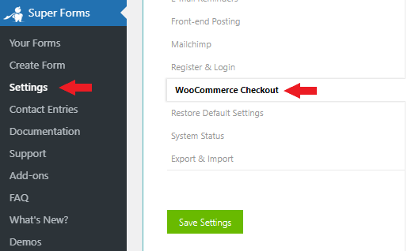
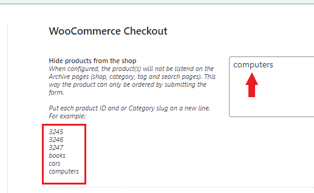

# Hiding product from shop and order via custom form

In order to only allow users to order the product via the form you build, you will have to follow the below steps:

1. Make sure you are running Super Forms **v4.9.800** or higher
2.  Go to **Super Forms > Settings > WooCommerce Checkout**: 

    <figure><figcaption>
WooCommerce Checkout settings
</figcaption></figure>
3.  Map the form with the product ID's and or Product category slugs under the **Hide products from the shop** setting. In the below example we will hide all products that belong to the category "Computers" which slug is "computers". 

    <figure><figcaption>
Hiding WooCommerce products from the shop based on Category slug or product ID.
</figcaption></figure>
4.  Click **Save Settings** 

    <figure><figcaption>
Save your WooCommerce settings
</figcaption></figure>
5. Visit your shop Front-end and confirm the products are no longer visible. Also confirm you can still order them via your forms.
