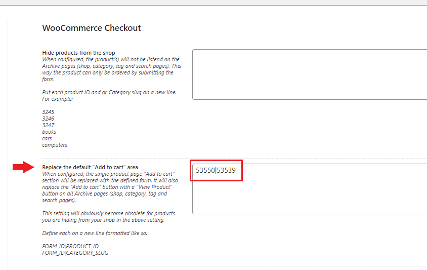
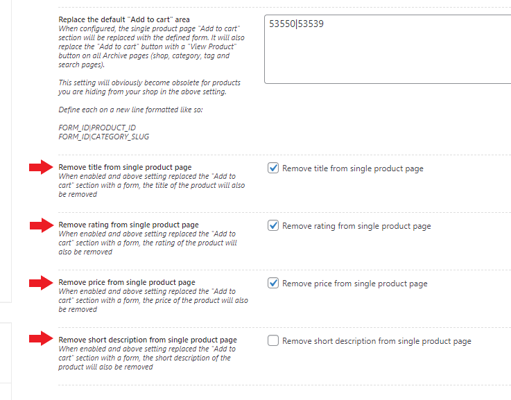
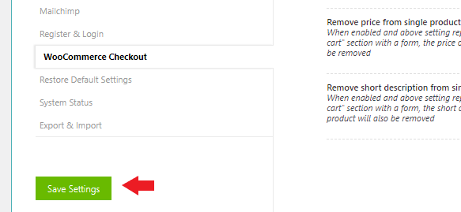

# Replacing the "Add to cart" on a product page with a form

By default WooCommerce has a so called "Add to cart" button with a "Quantity" field on the product pages. In case you want to replace this section/area with a form, you can do the following:

1. Make sure you are running Super Forms **v4.9.800** or higher
2.  Go to **Super Forms > Settings > WooCommerce Checkout**: 

    <figure><figcaption>
WooCommerce Checkout settings
</figcaption></figure>
3.  Map the form with the product under the **Replace the default "Add to cart" area** setting: 

    <figure><figcaption>
Replacing the default "Add to cart" area/button with a custom form.
</figcaption></figure>

4.  Optionally hide the **Title**, **Rating**, **Price** and or **Short description** from the product page: 

    <figure><figcaption>
Removing the title, rating, price and short description for WooCommerce products on the front-end.
</figcaption></figure>
5.  Click **Save Settings** 

    <figure><figcaption>
Save WooCommerce settings
</figcaption></figure>
6. Visit the product on the Front-end and confirm that the default "Add to cart" button is replaced with the form.
