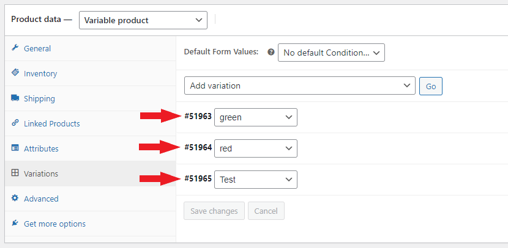
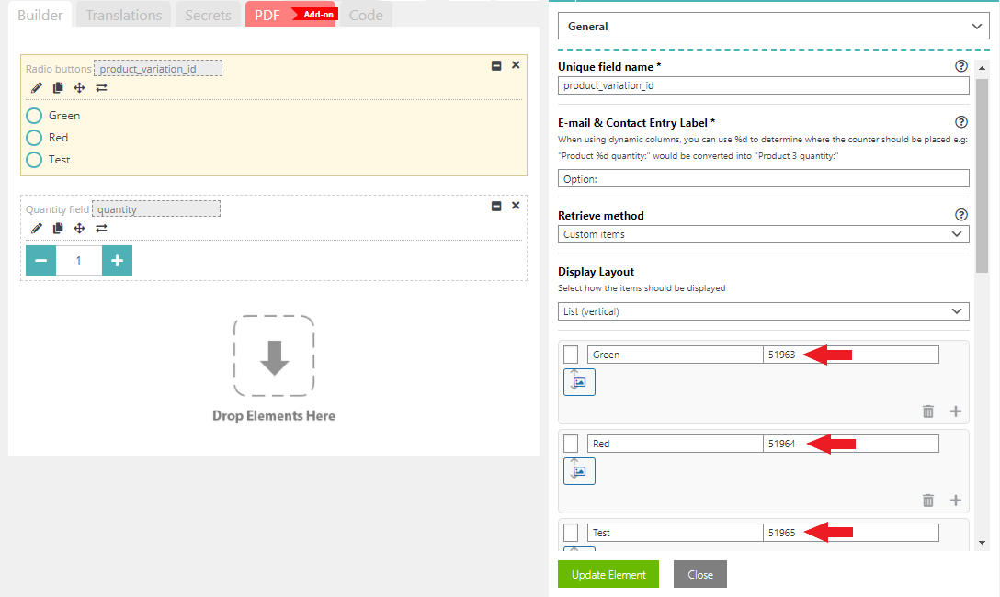

# Variable product checkout (variations)


If you haven't already, first make sure you create a [**Variable product**](https://woocommerce.com/document/variable-product/) within WooCommerce.


You should now be able to see your variation ID's:

<figure><figcaption><p>Create a variable product in WooCommerce.</p></figcaption></figure>

You will need these ID's in your form so you you can parse them to the settings in your form under "Form Settings > WooCommerce Checkout".

In our example we will add a "Radio button" element, with three options to choose from. These three options will be called "Green", "Red", and "Test". Each of them will hold the corresponding variation ID.

In our case we named the field **product\_variation\_id** so we can retrieve the variation ID later by calling {product\_variation\_id} tag.

We also added a Quantity element, just so the user can choose the quantity themselves, but this is not required if your users can only order 1 product at a time.

<figure><figcaption><p>Define the product ID's on each of the Radio button items as their value</p></figcaption></figure>

Now we can configure the checkout settings.

Go to **Form Settings > WooCommerce Checkout** and check "Enable WooCommerce Checkout", and optionally the other settings as desired.

Under "Enter the product(s) ID that needs to be added to the cart" configure the product ID, along with the tags to retrieve the selected variation ID. Our product ID is **51962**, so our final line will be:

```
51962|{quantity}|{product_variation_id}
```

<figure><figcaption><p>Define products that need to be added to the cart with the use of the {tags} system</p></figcaption></figure>

Now test the form, and see if the product along with the chosen variation was added to the cart.
