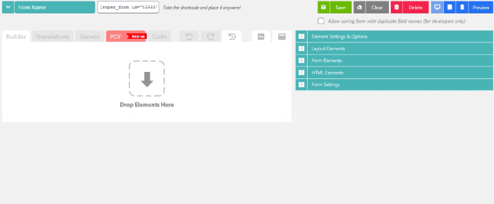

# Adding form elements

Once you [created a form](creating-a-form.md), you can start adding elements. There are currently three different types of elements:

* [Layout elements](../elements/layout-elements/)
* [Form elements](../elements/form-elements/)
* [HTML elements](../elements/html-elements/)

To add an element to your form open the section for your type of element e.g "Layout elements".

Hover over the element, hold down your left mouse button and drag it onto the canvas where it says "Drop elements here" like so:

<figure><figcaption>
Drag and drop WordPress form builder
</figcaption></figure>


**Note:** In general it is good practice to always use columns when building your forms. This will allow you to move multiple elements around, and makes it easier to re-arrange, delete, duplicate elements in bulk.

