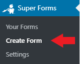
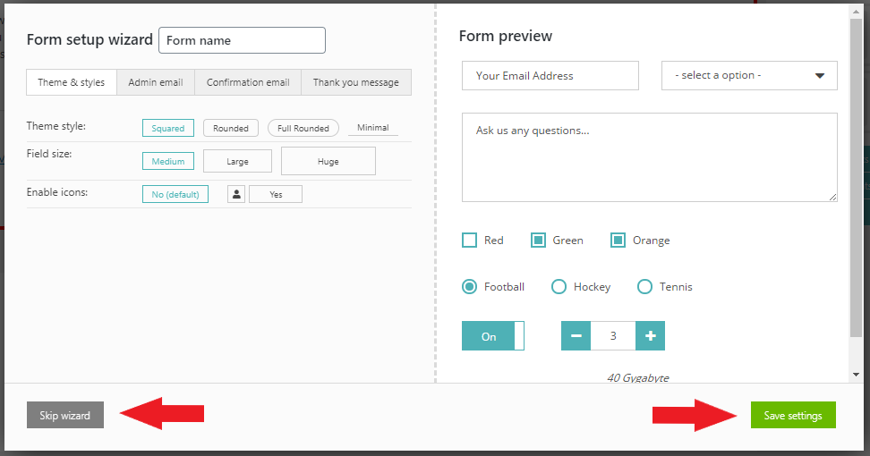

# Creating a form


**Important:** Before creating your first form, please read the [**First time setup**](first-time-setup.md) article in full. It contains important information about some of the core Super Forms functionalities which shouldn't be overlooked. Especially understanding the [differences between Global settings and Form settings](creating-a-form.md#h_01evm3d182pegrfy3r2zxyvka0) and the configuration of [Secure file uploads](secure-file-uploads.md).


To create a new form navigate to **Super Forms > Create Form**.

<figure><figcaption>
Create a new WordPress form
</figcaption></figure>


If you don't want to build a form from scratch you can checkout many of the available demo forms under **Super Forms > Demos** menu. Use them as a starting template or to simply learn about the possibilities of the plugin.


If this is the first time you create a form, you will see a walkthrough guide. Don't skip it, just follow along until you finished it. When you finished come back to this guide and continue reading below.

If you previously created a form you will now see the Form setup wizard where you will be able to review the most important form settings based on your global settings.

Change them accordingly when necessary and click on the **Save settings** button. If not, you can proceed by clicking the **Skip wizard** button.

<figure><figcaption>
WordPress form setup wizard
</figcaption></figure>

This will create a new form from scratch with the settings based on your [**Global Settings**](first-time-setup.md#h_01evm3ctsvapkbst5j5kq9bk3y) with the selected settings defined during the wizard.


**Note:** The [**Global Settings**](first-time-setup.md#h_01evm3ctsvapkbst5j5kq9bk3y) will never affect previously created form settings if they do not share the same values. It is good practice to change settings on the form itself after creating one.

