# Editing elements

### Editing a single element

Each element can be edited via the **Pencil** icon.

<figure>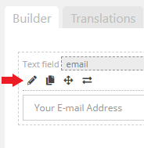<figcaption>
Edit text input field element.
</figcaption></figure>

The **Element Settings & Options** section will open up where you can change the available settings for this specific element.&#x20;

By default it will display the **General** settings which are settings that you most commonly will be changing. Depending on what element you are editing you can browse to different sub-settings by clicking on the dropdown and choosing the specific setting category like so:

<figure>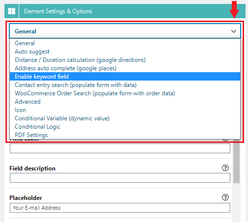<figcaption>
Switching to a different element setting category/section.
</figcaption></figure>

After you are done making the necessary changes for your element click **Update Element** button.

<figure>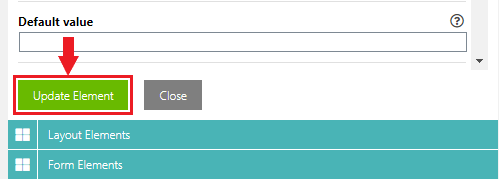<figcaption>
Updating the element settings.
</figcaption></figure>

After you made changes to your form, you can update it by clicking the **Save** button.

<figure>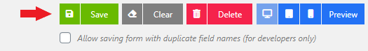<figcaption>
Saving changes made to the form.
</figcaption></figure>

A quick demonstration on how to edit an element, updating the settings and saving the form.

<figure>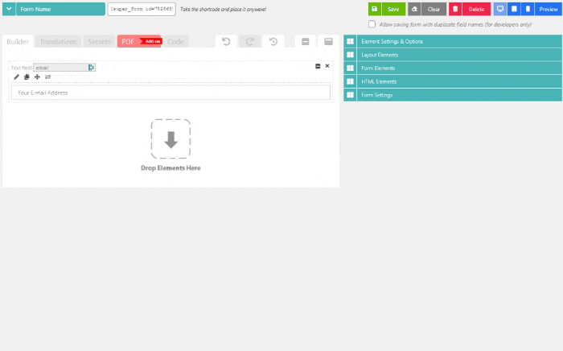<figcaption>
Edit the element, update the settings and saving the form.
</figcaption></figure>

### Deleting elements

To delete an existing element you can click the **X** icon at the top right of any element. If the element has inner elements (think of a column or multi-part) then all of it's inner elements will also be deleted. If you deleted an element by accident you can use the Undo/Redo buttons to revert the change.

<figure>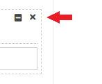<figcaption>
Delete element.
</figcaption></figure>

<figure><figcaption>
Demonstration on how to delete elements.
</figcaption></figure>

### Minimizing & maximizing elements

To **minimize** or **maximize** elements you can click the \[-] icon at the top right of each element. When you minimize an element that contains inner elements, it will hide all of it's inner elements. This makes it easy to move or rearrange many elements at the same time. Once an element is minimized you can click the same icon to maximize it again.

<figure>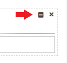<figcaption>
minimize element.
</figcaption></figure>

To minimize or maximize **all elements at once** you can use the following buttons instead:

<figure>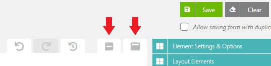<figcaption>
minimize or maximize all elements.
</figcaption></figure>

Demonstration on how to minimize and maximize your elements:

<figure>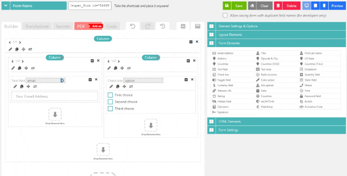<figcaption>
minimizing and maximizing elements demonstration.
</figcaption></figure>

### Undo & Redo changes (revert changes)

When working on your form Super Forms will keep track of what your last changes were. If you accidently deleted an element you can click the **Undo** & **Redo** buttons to get back to the previous change.

<figure>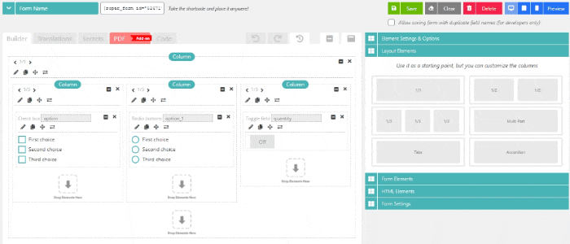<figcaption>
revert changes.
</figcaption></figure>

### Restoring from an automatic backup

Backups will be created automatically by Super Forms each time you **Save** the form. This can come in handy when you wish to revert the form back to a previous "version".&#x20;


In total, a maximum of **50** backups **per form** will be created. Once this limit is reached any older backups will be deleted automatically in order to keep your database clean.


<figure>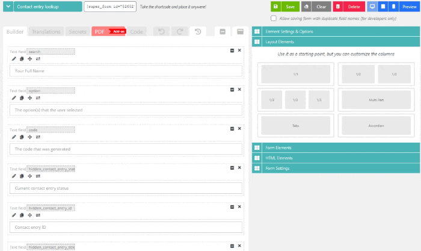<figcaption>
Restoring form backups.
</figcaption></figure>

