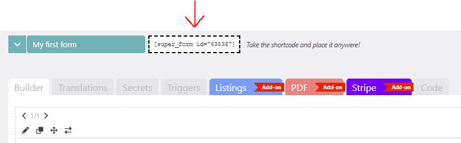

# Publishing your form

Once you have created and tested your form you can publish it to your WordPress front-end. Grab the form shortcode from the builder page and put it inside your page content.

<figure><figcaption>
Copy the shortcode on your page where you want to display your form.
</figcaption></figure>


**Tip:** If you are using a builder plugin or theme, you might want to insert the shortcode inside a native shortcode element if available. Otherwise you can put it inside a Text element.


Congratulations! :tada:, you just finished the [Quick start](/broken/pages/Qzg82nE8LuIlLKiDCT45) guide.

Use the menu to learn more about Super Forms [features](/broken/pages/TblcVKfb0ZVeA92ARvXo), [elements ](/broken/pages/j2MnemiifA0Al8NdbeET)and [third party integrations](../features/integrations/) to build even more advanced forms!
