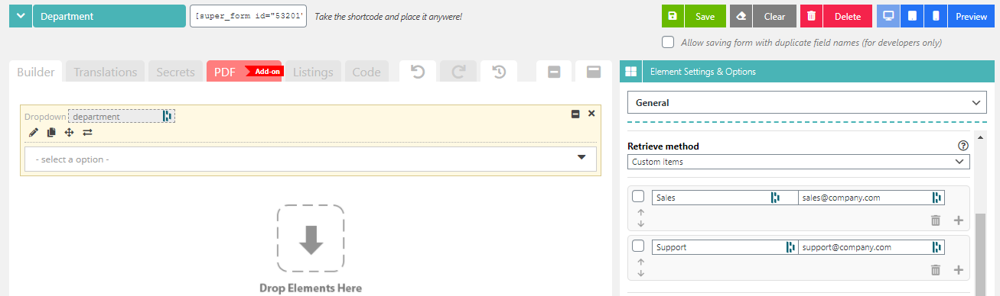
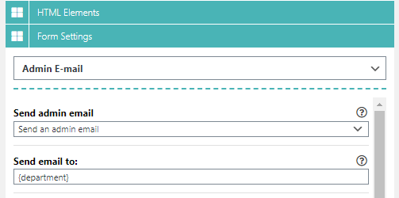
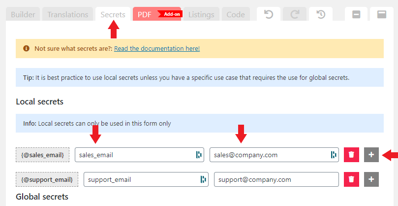
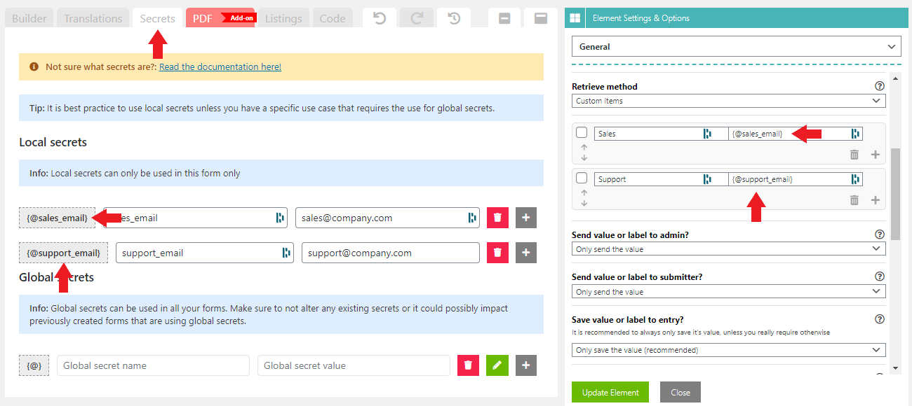
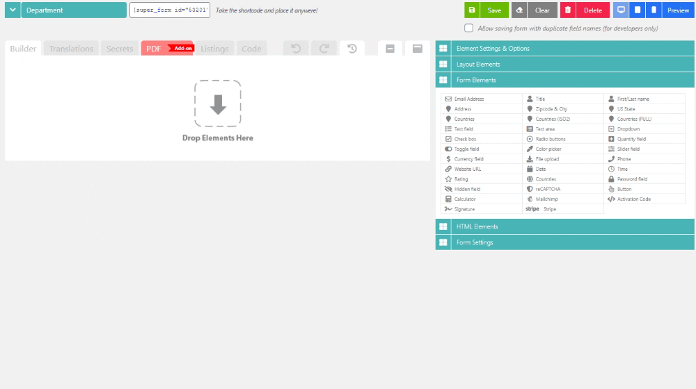

# Sending emails to specific department for WordPress contact forms



Let's assume you have multiple departments within your company that handle different inquiries.

For instance, you might have a **Sales** department salescompany.com and a **Product support** department supportcompany.com.

When a user fills out the form you might ask the user if the inquiry is about sales or support.

Based on the selection you can then send it to the corresponding E-mail address.

There are multiple ways to accomplish this but the easiest way to do it is to add a dropdown named "department" and adding 2 items like so:

<figure><figcaption>
Define each department email address for the dropdown element.
</figcaption></figure>

Now you can set the "Send email to:" setting to retrieve the value from the dropdown by calling the **{department}** tag. This will either have the value "salescompany.com" or "supportcompany.com".

<figure><figcaption>
Set the dropdown field name tag as your E-mail to header for your Admin email.
</figcaption></figure>

The above example works just fine, however it is good practice to not expose an E-mail address directly into the source code of a web page (to prevent spam, because of bots being able to index it).

This is where the build in **Secrets** system comes into play.

You can configure secrets like below. This will allow you to set the dropdown values to be **{@sales\_email}** and **{@support\_email}** which will not expose the E-mail address in the source code. But by calling **{department}** tag it will replace the underlaying value with the actual E-mail address server side.

First go to the "Secrets" tab, and configure your secrets like so:

<figure><figcaption>
Define email addresses under secrets for secure use.
</figcaption></figure>

After configuring the secrets, you can edit your dropdown and set the values to the secret tags like so:

<figure><figcaption>
Define secret tags as dropdown values for the department dropdown.
</figcaption></figure>

Demonstration on how to configure this from scratch:

<figure><figcaption>
Demonstration on how to define secrets for a dropdown element.
</figcaption></figure>

